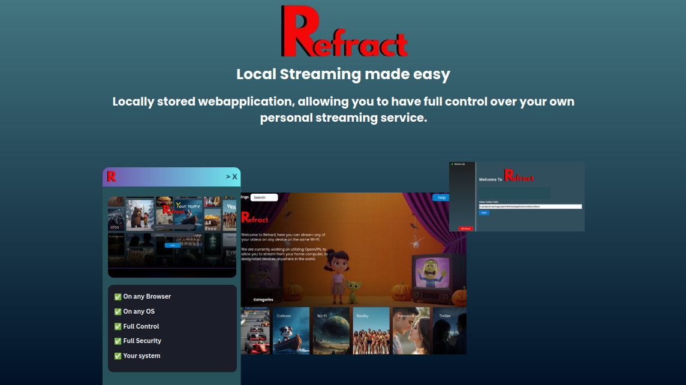
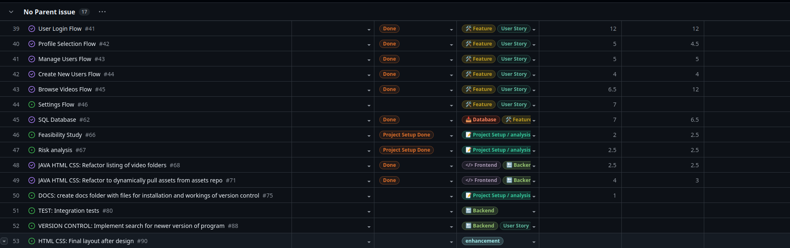
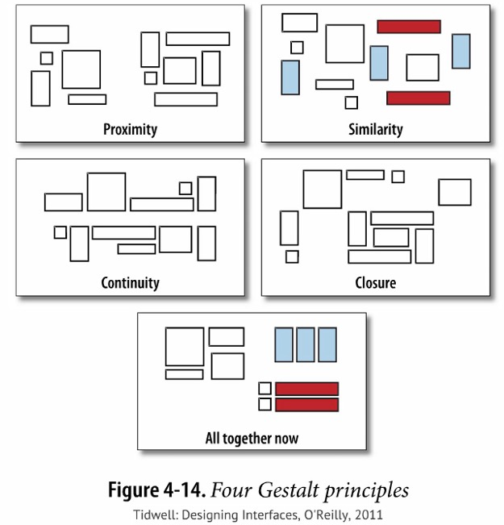

<h1 align="center">

   
  
   
  Streaming where you decide
</h1>

<h1 align="center">
  
   
  

</h1>

**Read about the full development process here:
[Refract article](https://niklasholtlau.web.app/R.html)**

* ##### Download the Installer: [Here](https://example.com)
* [Go to Recent updates](#Recent-updates)

## 🌐 Socials:
 

<strong>Contact me on</strong>: niklas1997@live.dk <strong>or here on Github:</strong> nikholt1

## Table of contents
* [Getting started](#-getting-started)
* [Future implementations](#future-implementations)
* [About](#about)
* [Why](#why)
* [SCRUM agile](#SCRUM-agile)
* [Maintenance and Contribution](#maintenance-and-contributions)
* [SWOT and Risk Analysis](https://github.com/nikholt1/HT/blob/master/analysis/HT%20SWOT%20analysis%20and%20Risk%20analysis.pdf)
* [Feasibility Study](https://github.com/nikholt1/HT/blob/master/analysis/HT%20Feasibility%20Study.pdf)
* [Go to Retrieve lost username and password guide](#Retreive-username-and-password-guide)
* [UI/UX and wireframe](wireframe)
* [Go to Database Setup](#database-setup)

  
<!--What the project does
    Why the project is useful
    How users can get started with the project
    Where users can get help with your project
    Who maintains and contributes to the project--> 

## About
This project is a locally run web-application, allowing users to view and stream videos from a locally stored
host computer. The System is a desktop application that through Springboot framework serves a web-application on the users Wi-Fi, allowing
anyone on the same Wi-Fi to access the specified folders with the content and stream videos from said web-application.
The system installs a default folder structure and executable application, that together with a SQLite database lets the user register profiles and stream the content from them.
The system also allows the user to add new folders or modify the existing default folders for categories of content.

## Why
Given the rising annoyance of streaming services' rising prices together with more ads implementations and
since most of my projects are not made for public display, i decided to make this locally run streaming service.

## [SCRUM](https://www.scrum.org/) agile
I worked using [SCRUM](https://www.scrum.org/) sprints. Through Github projects I created a backlog with the User stories that where derived from the functionality
that I wanted the system to be capable of.
After creating the backlog, I made a [Feasibility Study](https://github.com/nikholt1/HT/blob/master/analysis/HT%20Feasibility%20Study.pdf), where i concluded that the project
might definitely was a "No-go" if I made the application paid for. Therefore, made the application free to use, which was intenden from the beginning.
With the application being free to use and open source the program was a "GO".

After the feasibility study I made a [SWOT Analysis](https://github.com/nikholt1/HT/blob/master/analysis/HT%20SWOT%20analysis%20and%20Risk%20analysis.pdf) thereafter i made a [Risk Analysis](https://github.com/nikholt1/HT/blob/master/analysis/HT%20SWOT%20analysis%20and%20Risk%20analysis.pdf)
which gave me a good insight in the possible strength and opportunities this project could give me, while it forced me to determine the threads and weaknesses i had as a single developer.

I worked using Github projects where i used the [SCRUM Board](https://github.com/users/nikholt1/projects/6) and [Issues](https://github.com/users/nikholt1/projects/6/views/7) to keep track of the progress of the project
and to give me an oversight of what needed to be done, and what had been completed.

**Sprint 0: 1 week**
* Project Backlog - what is the goal
* Feasibility study - is the project a "GO"?
* SWOT Analysis - gather information to determine the projects status
* Risk Analysis - determine the most influential threads and weaknesses, and how to asses them

**Sprint 1: 2 months**
* Prioritization - What is need to have, and what is nice to have?
* Markup - Write out the MVP (minimal viable product)
* User stories - write down (at a minimum) the need to have User stories and categorize in Tasks and subtasks
* Database layout
* Project structure
* Create images in Blender, Spline, Canva and Gimp
* Data Access Object
* Repository and service for MVP
* Controller implementation for endpoints
* Wireframe frontend layout
* Make frontend in HTML CSS and as little JS as possible (thymeleaf)
* Springboot security configurations
* Code design refine
* Cleanup
* Installation script
* Updating script
* Version control
* Documentation
* Deploy

  <strong>Sprint 2</strong> will be documented in here as soon as the backlog is <strong>Done</strong>

**Sprint 2:**
see [Future implementations](#future-implementations)

## Maintenance and contributions
### Github versions and Automatic update
The prod system automatically searches for the latest version on Github versions, and automatically updates itself after comparing its own version to the newest version.
The version control is maintained by me and contributions that are accepted will be implemented in newer versions of the system once i roll out a new version of the system to Github version. 

## 💻 Getting started

  <strong>The installation</strong> is a simple folder mkdir and structure script, that downloads the JAR file alongside it.

## Installation
I have designed an installer script that can be downloaded, which through automation creates the necessary folder-structure
and installs the executable and assets in the default folders, together with the default SQLite database.

<!-- fix -->
* Download the installer
 * Download the installer: [Here](https://example.com)
 * Select the preferred _directory_ where you want the program to be installed
 * Wait for the installer to set up the program
 * Press finish

Now the Refract should automatically launch, if not, search for it and launch it.

## Modification of the system
From here the user has the option to specify a certain directory if they please, or they can populate the
default folders with the videos they want. To add a image to a specific video, the user can place the video with the name (video.mp4) and in the same folder
place an image with the exact same name as the video (video.jpg). From there the system will automatically update the backend to serve the video
and place the cover of the video with the dedicated image to the frontend.

**First login**
* The first login happens in the URL that the desktop application specifies.
* Here the default username and password for the first login is
* Username: Admin
* Password: admin
* This can be changed, and user is encouraged to change at least the password

**Creating a user**
* Once the user has logged in for the first time, and configured the main user
* The user can create a new profile, by pressing "add profile"
* Here the user can fill out the form, for username and choose a image for the profile picture

**Custom profile picture**
* The user has the option to choose a custom profile picture
* By navigating into the directory where the program has been installed
* Navigating into the **"data"** folder
* Navigating into the **"profileImages"** folder
* Here the user can place any image, preferably .jpg and in the program choose the specific image as the profile image

**To specify new path**
* Log in to the program
* Choose any profile
* Navigate to the **"settings"** endpoint
* Scroll down, and find **"path"**
* Change the path to the desired new path

Now the system should automatically fetch the content from the new specified path

**To add new content to the category folders**
* Find the specified path in the OS's folder manager
* Add a subfolder with a specific name or navigate into a existing folder
* If a new folder has been created, you can choose to save a image with the exact name as the parent folder.
* Place any video in the folder
* Place a image with the exact name of the video

Now the system should automatically serve the new category folder with its corresponding image, and video with its corresponding image.

## Retreive username and password guide
The default Username and Password for the login, is username: Admin and password: admin. After initial login the user has the option and is encouraged to
change the username and password to what they desire. This is locally stored on their host computer, which means that the system does not send any data to anywhere, which means that if the username and password is lost,
the user would have to follow the "retrieve username and password" guide, to fetch the lost username and password directly from the SQLite database.

**retrieve username and password guide**
* In the OS folder manager, navigate to the directory where the system is installed
* In the system folder, navigate to the **"Data"** folder
* In the datafolder look for the **"hometheaterdb.db"** SQLite database
* If the database is present, we now know that the username and password should be there

## Wireframe

  <strong>See the full wireframe <a href="https://github.com/nikholt1/HT/blob/master/analysis/wireframe.pdf" style="color:#dfe7df; text-decoration:underline;">here</a></strong>. 
  Not all media elements are the final product in the wireframe.

I made the **UI/UX** following [Schneidermans Golden Rules](https://www.designprinciplesftw.com/collections/shneidermans-eight-golden-rules-of-interface-design) and [Jakob Nielsens Usability Heuristics](https://www.designprinciplesftw.com/collections/10-usability-heuristics-for-user-interface-design)
Where i likewise utilize the [Gestalt Principles](https://www.interaction-design.org/literature/topics/gestalt-principles?srsltid=AfmBOootr4XUiaC1LDM_bY0vK9PFvcCBogdPZFA1AS5ttJ0bPWXnbxkI) to design the wireframe for the frontend of the webapplication.

I made the choice to always have a "Help" button accessible, where the button takes the user to the build in help section under the settings endpoint.
Most of the design is made with the four Gestalt Principles:

See the [Wireframe Here](https://github.com/nikholt1/HT/blob/master/analysis/wireframe.pdf)

## Future Implementations

  <strong>Some</strong> of the implementations are <strong>Errors and brugs</strong> being fixed

* Resume and see watched videos
  * I am currently working on the last table of the SQLite database, "unfinished_videos", The user should be able to resume a unfinished video, or the system should be able to recognize which movies have been watched.

* Profile picture selection
  * The user should be able to, when creating a new profile, see the images that they can choose from
  * The user should be able to change profile picture and username for the profiles when they want to

* Linux compatibility error
  * On linux the images folders are incorrect, missing a "/"
  * recogninze OS and fix the missing "/" for linux users

## notes

<strong>Notes</strong> will be updated dynamically, depending on system implementations.

- Implemented user_profile_picture_path varchar(255) into database for profile picture handling per user.
08/10/2025

<!-- Database Setup section END -->

## Recent updates
* [14/11/2025](https://example.com)
